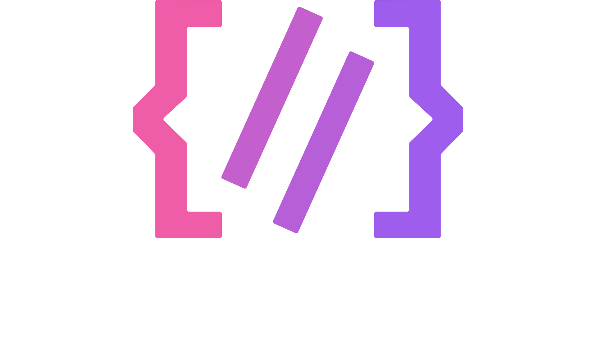
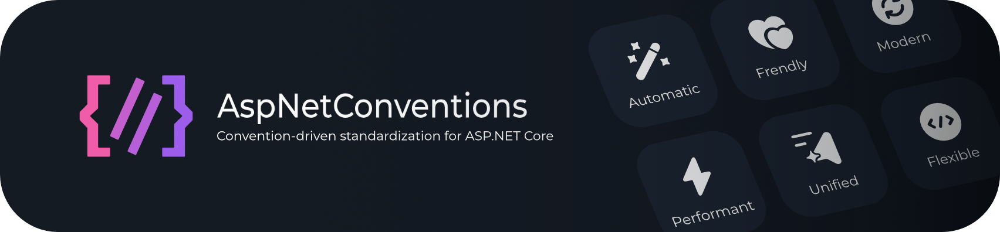

# AspNetConventions


[](https://dotnet.microsoft.com/en-us/download)


<br />
<div align="center">
  <picture>
    <source media="(prefers-color-scheme: dark)" srcset="./assets/asp_net_conventions_dark.svg" width="250">
    
  </picture>
</div>
<br />

**Automatic naming conventions for ASP.NET Core** - Transform your routes, parameters, and responses to kebab-case, snake_case, camelCase, or PascalCase with zero boilerplate.

<div align="center">
    <picture>
        <source media="(prefers-color-scheme: dark)" srcset="./assets/banner_dark.png" width="100%">
        
  </picture>
</div>

## Features

- **Automatic Route Transformation** - `/GetUserById` → `/get-user-by-id`
- **Parameter Binding** - `{UserId}` → `{user-id}` with automatic binding
- **Response Formatting** - Standardized JSON responses
- **Multiple Endpoint/Routes Types** - MVC Controllers, Minimal APIs, Razor Pages
- **Flexible Casing** - kebab-case, snake_case, camelCase, PascalCase
- **Zero Overhead** - Conventions applied at startup

## Quick Start

### Installation

```bash
dotnet add package AspNetConventions
```

### Basic Usage

```csharp
var builder = WebApplication.CreateBuilder(args);

// Add conventions to MVC/Razor Pages
builder.Services.AddControllersWithViews()
    .AddAspNetConventions();

var app = builder.Build();

app.MapGet("/GetUser/{UserId}", (int UserId) => new { userId = UserId });

// Apply conventions to Minimal APIs
app.UseAspNetConventions();

app.Run();
```


## Examples

### MVC Controllers

```csharp
[ApiController]
[Route("api/[controller]")]
public class UserProfileController : ControllerBase
{
    [HttpGet("GetById/{UserId}")]
    public IActionResult GetById(int UserId) => Ok();
}

//Endpoint: GET /api/user-profile/get-by-id/{user-id}
```

### Minimal APIs

```csharp
app.MapGet("/WeatherForecast/{CityName}", (string CityName) => 
    Results.Ok(new { city = CityName }));
    
// Endpoint: GET /weather-forecast/{city-name}
```

### Razor Pages

```csharp
// Pages/UserProfile/Edit.cshtml.cs
public class EditModel : PageModel
{
    public void OnGet(int UserId) { }
}
// Route: /user-profile/edit/{user-id}
```

## License

This project is licensed under the MIT License - see [LICENSE](LICENSE) file for details.

## Acknowledgments

- Built on ASP.NET Core's extensibility
- Thanks to all [contributors](https://github.com/keizrivas/AspNetConventions/graphs/contributors)

## Support

- [Report Issues](https://github.com/keizrivas/AspNetConventions/issues)
- [Discussions](https://github.com/keizrivas/AspNetConventions/discussions)

---

**Made with ❤️ for the ASP.NET Core community**